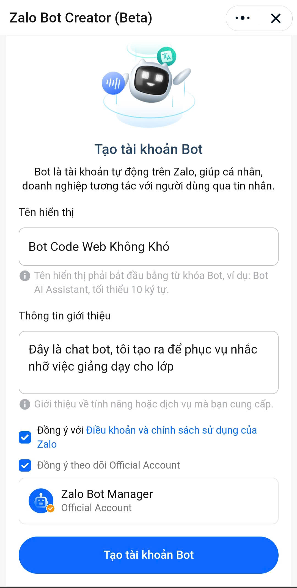
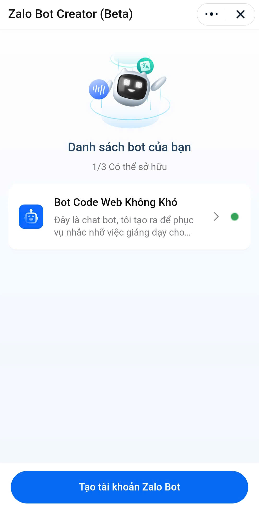
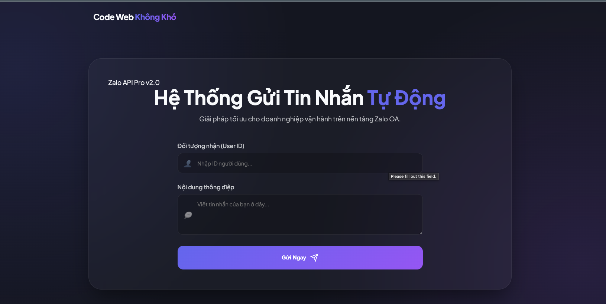

# Code Web Không Khó – Zalo Chat Bot

<p align="center">
  
</p>

<p align="center">
  
  
</p>

<p align="center">
  
</p>


## Giới thiệu

Đây là Chat Bot Zalo Tự động khi gửi từ hệ thống, đây là mẫu bạn có thể dựa trên và nâng cấp theo doanh nghiệp hay hệ thống của bạn.

## Link Tạo: https://bot.zapps.me/docs/create-bot


## Cách chạy dự án

### 1️⃣ Yêu cầu
- NodeJs Version >= 20
 
### 2️⃣ Khởi động hệ thống

```bash
npm install

npm run dev
```

Sau khi chạy xong:

🚀 Server chạy tại http://localhost:3001
📡 Webhook: http://localhost:3001/webhook
🧪 Test UI: http://localhost:3001

---

## Các API chính

### Lấy UserId
```
GET get-updates
```

### Gửi Message Chat Bot
```
POST /send-message
```

## Tác giả

**Code Web Không Khó**  
---

## 💖 Donate Ủng Hộ

Nếu bạn thấy các source hữu ích và muốn mình tiếp tục phát triển nội dung miễn phí, hãy ủng hộ mình bằng cách donate.  
Mình sẽ sử dụng kinh phí cho:

- 🌐 Server, domain, hosting
- 🛠️ Công cụ bản quyền (IDE, plugin…)
- 🎓 Học bổng, quà tặng cho cộng đồng

### QR Code Ngân Hàng

Quét QR để ủng hộ nhanh:


**QR Code ABBank**  
- Chủ tài khoản: Nguyễn Tiến Tài  
- Ngân hàng: NGAN HANG TMCP AN BINH  
- Số tài khoản: 1651002972052

---

## 📞 Liên Hệ

- 🎥 TikTok Source: [@hoclaptrinhvui](https://www.tiktok.com/@hoclaptrinhvui)
- 📚 Tiktok Dạy Học: [@code.web.khng.kh](https://www.tiktok.com/@code.web.khng.kh)
- 💻 GitHub: [fdhhhdjd](https://github.com/fdhhhdjd)
- 📧 Email: [nguyentientai10@gmail.com](mailto:nguyentientai10@gmail.com)

Cảm ơn bạn đã quan tâm & chúc bạn học tập hiệu quả! Have a nice day <3!!
